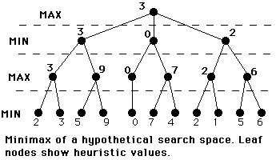

**Adversarial games** can be viewed as a game tree, where from starting position a player makes all
possible moves, from each of these newly created positions, another player makes all possible moves.
The game continues till all the leaves are **terminal**.

Let's assume that we can build the whole **game tree** (which is possible only for games with a relatively
small game tree). In such a case we can explore all the paths and find which one leads to the best 
position. The problem here that we can not just find a win and think that the opponent will allow you
to reach this position. Your path should select a path that gives you at least the value you expect
to get no matter what your opponent does (when he selects the best **ply**. In the future I will use 
move as a substitution for a ply). I told at least, because if opponent makes not an optimal move you
will get a better reward.

------

When thinking about the game tree, it is nice to think about two players Max and Min. Max always 
selects the node with the highest reward (from the list of his children), whereas Min selects the
node with the smallest reward. So if the node has children with rewards (5, 3, -2, 8, 14, 2) Max will
select 14, and Min will select -2. Now if the game starts with Max, we can check each layer of the 
tree (from the bottom) and tell what the reward would be in with the best game. This algorithm is 
called **Minimax**. Here is the example:

Few important things to know about Minimax. It:
- does not care about the ordering of the leaves and which branch you investigate first
- is optimal (will find the best solution)
- searches the whole tree
- the best way to implement it, is using a recursion

So having a full tree, the game can be solved using a minimax, but for a lot of games it is too
expensive (impossible) to construct a full tree. To overcome this problem it makes sense to construct
only a small subset of the tree and hope that the solution you get will be close to a real solution.
So the easiest approach is to build a tree with depths D, evaluate the leaves and treat them as terminal.

Here the main problem is how to evaluate the position which is clearly not a terminal one. The best
way to achieve it is to have a heuristic of how winnable is a position. First of all this heuristic
should return correct values for win/lose/draw, all other position should be at least in between of
win and lose. The heuristics should show a likelihood of a position to be win. (if a player A has 1 
attacker and B has 3, the heuristic should show that B is more likely to win). This is called an 
**evaluation function**. Evaluation function is really important because the wrong function will lead
your algorithm astray. The evaluation function should be easy to compute and currently one of the 
good approaches is to use a linear EF. It can take various metrics. For example in chess this can be
material, number of controlling squares, pawn structure, king safety, closeness to promotion.

This approach is good, but it can lead to an important problem in adversarial games. **Horizon effect**
happens when a position looks good/bad only from the depths at which we look at it. If we will look 
a couple of steps deeper, the situation can change dramatically. The obvious solution - investigate 
deeper does not make any sense because we do not know when exactly the effect happens. One possible
solution is called **quiescence search**. This uneven tree development reduces the horizon effect.

Notice that we are treating the case of Max and Min player differently in our minimax implementation,
because no one told that the amount of reward is different for a win/lose for Min/Max. But in a lot 
of games (tic-tac-toe, chess, go, ...) are **zero-sum games** which means that 
`max(a, b) == -min(-a, -b)`. Using this fact it is possible to rewrite a minimax in a simpler way. 
This modification is called **Negamax**. It allows to make the minimax implementation even more 
compact.

------

So what is needed to implement a minimax/negamax algorithm. The simple version needs only a couple
of functions:

- *isTerminal* checks whether the node is in a terminal state
- *getHeuristicValue* which calculates the heuristic value of a node
- *getChildren* which extracts all the children of a current node
- *search* basically a minimax/negamax search

A couple of improvements can be done with:

- *quiescence search*

The stab for an algorithm can be found in *1_minimax_stab.py*. It will have placeholders for all the
functions except of the search function. Two different search functions are given, one for the minimax
and another one is for a negamax modification.

------

No one would expect that the whole heart of a minimax algorithm would take only 3 lines of code (this
is not what you expect from an algorithm which makes the best decisions). So let' check whether it 
actually correctly finds the best value of the game tree. In order to do this, we will be randomly 
generating trees and calculating their minimax values. *2_negamax.py* does exactly this.

So we verified that our current minimax implementation is correct, but is not really useful. It just
tells use something along the lines: "you can win 2$ from this position", but it does not actually 
tell us how to win them or at least which step should we take to win them. The solution is actually
pretty obvious. In addition to the returned value, return the child, which this value belongs to.

------

Now let's go ahead and implement the unbeatable tic-tac-toe engine.
WRITE STUFF

So now we have an unbeatable tic-tac-toe. I recommend you to test it on various test cases to see 
whether you will find a strange peculiarity of the algorithm. You should not necessarily test it, 
actually it is enough to look at the source code. I recommend you to do this before looking at the 
spoiler because it will improve the understanding of the minimax algorithm. Strangely enough, the 
unbeatable is not synonym for the best play. Our algorithm will never lose in a non-losable position,
and also will definitely win, once an opponent will make a mistake. But the algorithm will not fight
to the last breath (for it, losing in one more and losing in three moves makes no difference). It 
also will not try to create a potential traps (it assumes that its opponent as smart as it is so there
is no point of creating a trap). Luckily enough it is easy to solve: all you need is to modify an 
evaluation function a little bit.

------

So the algorithm works, returns a correct result, but the only problem is that it requires a full 
subtree search. Just a reminder that in a tree with a branching factor *b* and length *d* will require
a search over *b^d* elements.

Assuming that a machine can evaluate 1 million combinations per second and we have ten seconds to 
think about the move, what we can actually do with it. All we need to check is `b^d < ourPower`

Using this [table](https://en.wikipedia.org/wiki/Game_complexity), it is clear that:

 - tic-tac-toe is fully solvable
 - checkers can be analysed 15 plies ahead (not really bad)

The problem is that with this computational power, chess can give you only a little bit more than
[4 plies](http://www.wolframalpha.com/input/?i=35%5Ex+%3D+10%5E7) (two moves) ahead thinking. This
is not enough even for an amateur. We need something better.
