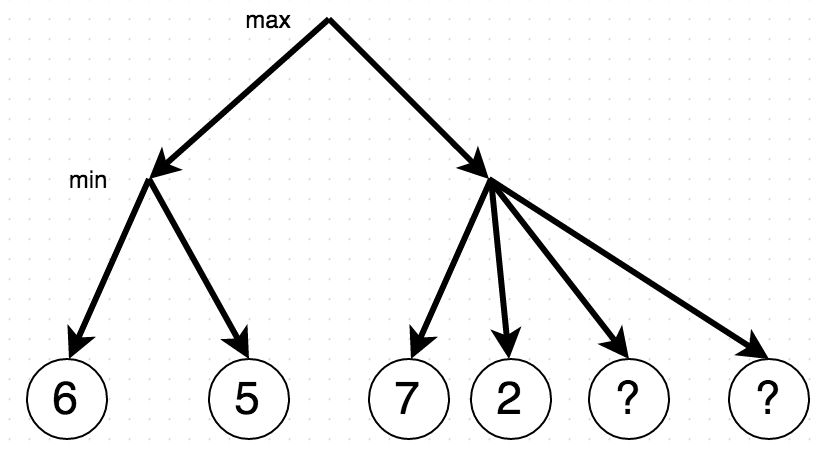

The slowness of the minimax comes from the exponential complexity that arises from the tree expansion.
Each new level of the tree has `b` times more leaves than the predecessor. We use DFS to analyse each
leave to find the right solution.

But we do not need to examine the whole tree to find the best solution. To understand why it is the
case, let's look at this tree following the minimax algorithm with a small modification. We will just
memorize our best worse decision.

In the beginning it will find 6. Now the min-player think "oh, at the very worse case I will lose 6 
points here". Should he examine the tree further? Definitely yes, because he might encounter a 
smaller value. So a min-player moves on, finds 5 and because it is smaller, selects it.

Nonetheless a min-player has finished analysing only one small subtree, we already have something to
say about a max-player. We do not yet know how much will he get, but we know that it will be at 
least 5 points and can only go higher. How much higher is depends on the second subtree. The 
min-player looks at the right subtree and sees 7. Now his very worst loss is 7 points and he goes 
further hoping to find something smaller. He sees 2 and important question arise: should he 
search further? Let's think. First of all, min-player does not care if he will find numbers bigger 
than 2 because he will select 2 anyway. But what if he will find something smaller (it is very 
tempting to check whether there is a -infinity behind the question mark)? Sadly this does not make 
any difference because on the very next step the max player will select 5.

So the algorithm is a minimax algorithm that maintains two values:

 - alpha, represents the maximum score that the max-player can assure for himself  
 - beta, the minimum score that min-player can assure for himself

In the beginning max-player starts with -inf, and min-player starts with inf (the lowest possible 
score they can achieve). With some of the moves, alpha and beta values starting to shrink. Whenever 
b becomes bigger than a, there is no point to search further. So let's go ahead and modify the minimax
algorithm a little bit to accommodate these changes. It is not hard to see that we can do a similar 
modification to a negamax algorithm.

Before we will run our algorithm on a real data, let's look at our modification. For our tree, this 
improvement does not look so promising (who cares that we skipped 2 nodes), but in reality it allows
dramatic improvement. To understand it from a very high level prospective, just imagine that each 
node is in fact the beginning of a big subtree. Before I can give you a little bit more confidence 
that this small improvement is actually significant we have to notice one important thing. In the 
minimax we absolutely did not care about the order of the leaves in the tree, but here the ordering 
of the leaves is important. A clear example is to reorder 7 and 2 in a previous tree, which will 
allow us to stop after investigating 2.

Knowing this two facts we can do some analysis. Let's assume a tree of depth d with the branching 
factor b. With the minimax we are forced to check b^d leaves. We saw in our previous example that it 
is always better to examine the best move first. Therefore if we will order all the moves based on 
their effectiveness.

If you scratch you head right now and think "but wait, is not the point of doing alpha beta to find
the best move? So if I already know the best move ordering why exactly should I do anything at all",
then you are totally right: if you know the perfect ordering you can just use it to play the game.
Similarly to a [quicksort](https://en.wikipedia.org/wiki/Quicksort) (an algorithm where you sort 
numbers by dividing them based on the partition) you do not need to know the very best move to achieve
a reasonable speedup with complexity.

It is interesting to see what happens if the leaves have random values. The proof is way harder, but
on average you expect to investigate $O\left ((b/\log b)^d \right )$. This approximation is not really
that good, because $b/ \log b$ is not really smaller than $b$ for big b. Good thing for us is that 
this approximation is accurate for big $b$ (on the order of thousands). For most of the games we know
the branching factor is way smaller. And for these values, the approximation is O(b^(3d/4)), which 
is actually surprisingly good. At last I have to highlight that the assumption we had here are 
unrealistic in a real word scenarios: it is highly unlikely that the branching factor is constant, 
and we already know that it is beneficial to have a un-constant length of the tree.