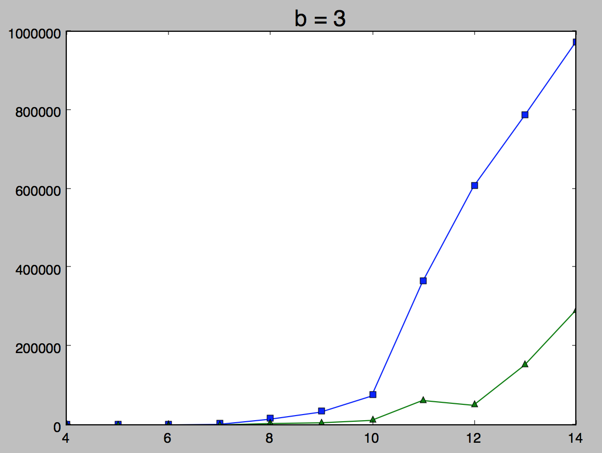
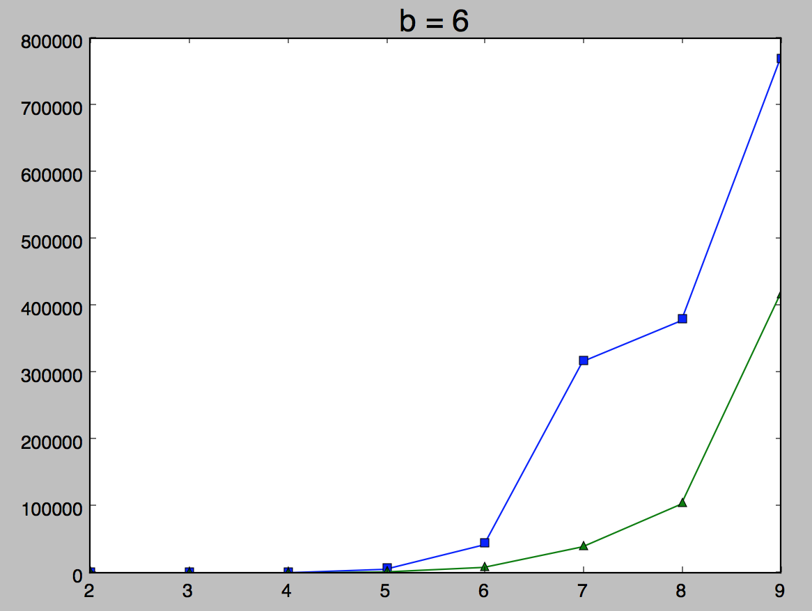
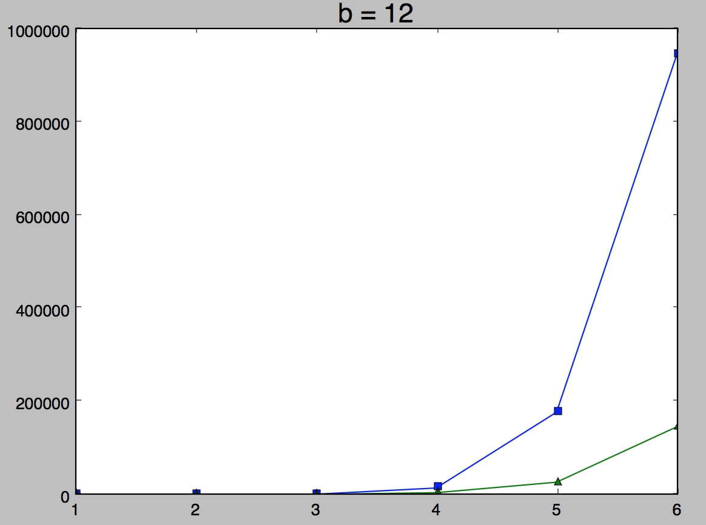

Now that we know how to code an alpha-beta and even created a stab for it, it is time to check 
from the practical point of view that the results from alpha-beta and minimax are the same. Also 
we can compare the speed of both algorithms.

To do this we will take our code for the negamax and just add a minimax search. Let's take the game 
of checkers as an example. There we have a branching factor approximately equal to 3. We can see
that for small values of d <= 13, the difference is not really that significant (minimax takes
approximately 1.8 seconds and alpha-beta is 0.15). But even for d=15 we already see a huge 
difference: a minimax takes 34 seconds, whereas aplha beta takes less than a second. Note that we
have to wait for a lot of time mostly because of the creation of a tree (we do not take this time in
the consideration).

Now you can check a couple of graphs for various branching factors (or can generate a couple of them
by your own and submit them to me). Take into the account that generation of the graph can take a 
significant amount of time.

As you can see, even on a random data we notice a significant speedup. So let's come back the ordering
of the move. It was mentioned previously that we do not need to have a perfect ordering to achieve 
the d/2 improvement. All we need is to select approximately good moves. This can be achieved with a 
couple of strategies:

 - use of a heuristics (in a chess it can be grab a better piece with a worse piece, do not move 
 backward, control more center points). For any other game it is important to consult the expert and
 learn a very high level approaches from him
 - use iterative deepening. Here we use a tree with a smaller level to order the tree of the level + 1
 We will come back to this a little bit later.
 
 The last minor step is to modify the algorithm to return one of the correct moves.
 
 Assignment. Write a full tree with depth and branching factor equal to 3 such that you prune
 absolutely nothing, another when you prune the maximum amount.